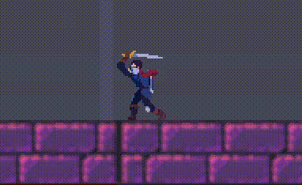
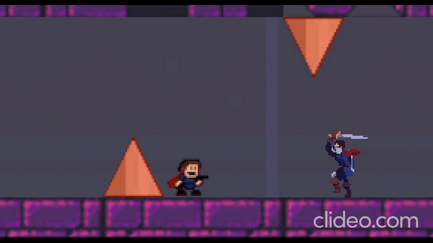
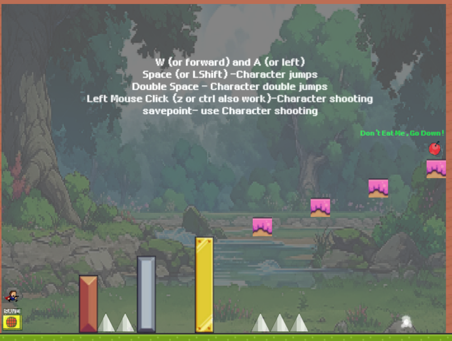
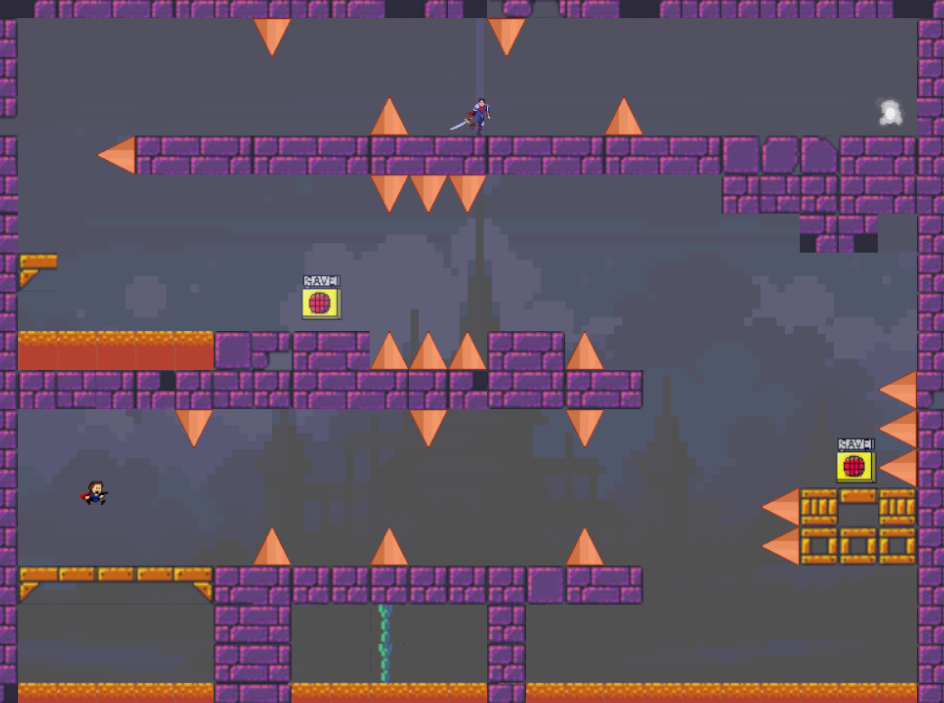
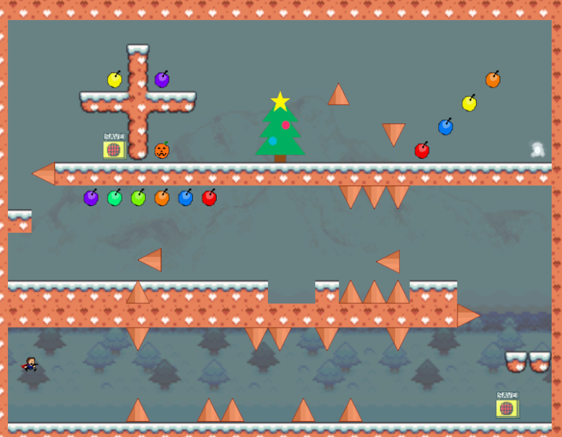

# I Wanna QAQ #

## Summary ##

**IWannaQAQ is a 2D side-scrolling game that challenges both your reaction and your keyboard using ability. Our game was inspired by the game "I Wanna be the guy", a challenging side-scrolling game famous for it's unexpected traps
and sudden death. After playing "I Wanna be the guy", our team decide to build our own I wanna series. Thus, this game is born. As the suffix QAQ(a crying face) indicates, this game is not a game that you can pass when lying on a sofa. Our
goal is to provide you a challenge, and the sense of accomplishment. Be patient, and enjoy.**

## Project Resources

[Web-playable version](https://lnp95.itch.io/i-wanna-qaq) 

[Trailor](https://youtu.be/ixP3epN1dXE)

[Press Kit](https://lnp95.itch.io/i-wanna-qaq)

[Proposal](https://docs.google.com/document/d/1_nMEb_RXa0Ur7HW8z5sD7NKg6w6jvhcvQI6_vIovgGs/edit#heading=h.m7k4pgdsz19u)  

## Gameplay Explanation ##
| Key | Function |
| --- | -------- |
| W (or forward) | Character moves forward |
| A (or left) | Character moves left |
| S (or back) | Character moves back |
| D (or right) | Character moves right |
| Space (or LShift) | Character jumps |
| Double Space | Character double jumps |
| Left Mouse Click (or Z) | Character shooting |

****

**Add it here if you did work that should be factored into your grade but does not fit easily into the proscribed roles! Please include links to resources and descriptions of game-related material that does not fit into roles here.**

[Detailed Contribution](https://docs.google.com/spreadsheets/d/1LMZtTGkEsrY30iUUHjTyAvzNhGUfZH5FAmNbdq0FOLI/edit?usp=sharing)

# Main Roles #

Your goal is to relate the work of your role and sub-role in terms of the content of the course. Please look at the role sections below for specific instructions for each role.

Below is a template for you to highlight items of your work. These provide the evidence needed for your work to be evaluated. Try to have at least four such descriptions. They will be assessed on the quality of the underlying system and how they are linked to course content. 

*Short Description* - Long description of your work item that includes how it is relevant to topics discussed in class. [link to evidence in your repository](https://github.com/dr-jam/ECS189L/edit/project-description/ProjectDocumentTemplate.md)

Here is an example:  
*Procedural Terrain* - The game's background consists of procedurally generated terrain produced with Perlin noise. The game can modify this terrain at run-time via a call to its script methods. The intent is to allow the player to modify the terrain. This system is based on the component design pattern and the procedural content generation portions of the course. [The PCG terrain generation script](https://github.com/dr-jam/CameraControlExercise/blob/513b927e87fc686fe627bf7d4ff6ff841cf34e9f/Obscura/Assets/Scripts/TerrainGenerator.cs#L6).

You should replay any **bold text** with your relevant information. Liberally use the template when necessary and appropriate.

## Producer - Lin Zhu
Email: lnpzhu@ucdavis.edu

For our game to run smoothly, it's crucial that our producers are both proactive and communicative to ensure all game components work together seamlessly, minimizing merge errors on GitHub. Additionally, the producer needs to manage the team members' workload effectively. I make it a priority to schedule tasks for everyone while maintaining flexibility, allowing our games to run more smoothly and be completed on time.

GitHub:

To prevent merge errors, I assign team members to work on their own scenes, and together, we merge all changes into the main scene. I take primary responsibility for handling pull requests, ensuring the code functions correctly, and managing merge errors. Furthermore, I've organized the project's assets into Unity folders, including scripts and audio, to improve organization.

Meeting:

To enhance efficiency and communication, I've set up a Discord server for our team, featuring multiple channels to outline links, roles, and goals. Over several weeks, we've conducted numerous meetings using this Discord server. To organize these meetings, I've created a meeting sheet to record the times and everyone's progress on tasks, available here: https://docs.google.com/spreadsheets/d/1LMZtTGkEsrY30iUUHjTyAvzNhGUfZH5FAmNbdq0FOLI/edit?usp=sharing.

We ensure that tasks are clearly defined during development and maintain a Discord group chat for daily, prompt communication. This method is effective for us as few issues or decisions require everyone's collaboration. We've found that everyone is available on weekends, so we hold weekly meetings via Zoom then. Additionally, I organize more meetings as deadlines approach.

Other jobs: participating in enemy design and implementing the enemy's mobile attack and death. I also create character bullets and implement shooting functions.

1. Introduced enemy in the levels
  - Enemy prefab is obtained from free online resource
  - Enemy script is added to make it attack the player and make it defend its region. [code](https://github.com/sodqwq/ecs179_final_project_winter_2024/blob/main/IWannaQAQ/Assets/Resources/Enemy/Hero%20Knight%20-%20Pixel%20Art/Demo/HeroKnight.cs)

2. Introduced bullet for the player
  - Implemented bullet shooting functionality. [code](https://github.com/sodqwq/ecs179_final_project_winter_2024/blob/main/IWannaQAQ/Assets/Scripts/Bullet.cs)
  - Adjusted layer interaction for correct bullet behavior. e.g., Bullet should not be hitting certain layers and should be passing damage when collider trigger is hit

3. Helped debugging and fixing various issues along the development of this game.

## User Interface and Input - Jinyuan Zhang

Email: ajyzhang@ucdavis.edu

Our User Interface includes basic start screen, a place to load your saved data after entering and a replay interface when player dies. We made the UI characters 2D retro style so they can fit to the style of our game.

Since this is a 2D side-scrolling game, all we need is player to move and jump. We set up 2 sets of input settings(demonstrated above), also consider the difficulty of the game, we allow players to shoot the save points to save their progress
instead of touching them. We are so nice aren't we?

For now our project only supports keyboard and mouse input.

1. **Helped adjust camera control**
   - Wrote the player follow style camera during eraly devloping stage
   - Replaced by a fixed camera that covers the whole map after several game testing

2. **Involved in UI design**
   - Providing art style support and creating in-game text
   - Adding UI art into [Resources](https://github.com/sodqwq/ecs179_final_project_winter_2024/tree/eb387ae3f3b9151d27c94014f9429e006fb6216b/IWannaQAQ/Assets/Resources/Font)
   - Adjust in-game UI [scripts](https://github.com/sodqwq/ecs179_final_project_winter_2024/blob/eb387ae3f3b9151d27c94014f9429e006fb6216b/IWannaQAQ/Assets/Scripts/Windows/RecordWindow.cs). Cooperated with Shengzhe Zhang

3. **Adjust the original input settings to make game control more fluent**
   - Adjusting [PlayerControl.cs](https://github.com/sodqwq/ecs179_final_project_winter_2024/blob/eb387ae3f3b9151d27c94014f9429e006fb6216b/IWannaQAQ/Assets/Scripts/Game/PlayerControl.cs) to create more comfortable gaming experience. Including input settings, shooting
     input detection bug and sound effect bug evolved within the original input receving script.

## Movement/Physics - Yirui Song
e-mail:yirsong@ucdavis.edu

1. **Vertical Movement** (`AutoMove.cs`, `AutoMove2.cs`, `MovingDown.cs`):
   - Objects move vertically with a constant speed (`speed` variable).
   - The direction of movement can change upon colliding with specific objects (e.g., "Ground" or "Trap" tags). This is detected using `OnCollisionEnter2D` and the `CompareTag` method for efficient tag comparison.
   - `MovingDown.cs` is set to move the object downwards initially by setting `movingUp` to `false` and adjusting the velocity accordingly.
   - Sprite flipping on the Y-axis is utilized to visually indicate the change in direction.

2. **Horizontal Movement** (`HorizontalMove.cs`, `HorizontalMoveRight.cs`):
   - Objects move horizontally with a constant speed (`speed` variable).
   - Direction changes on collision with certain objects, like "Pit" or "Ground", with a cooldown mechanism (`changeDirectionCooldown`) to prevent immediate direction changes back and forth.
   - Initial direction and movement setup are done in the `Start` method, with velocity set according to the desired initial movement direction.
   - Sprite flipping on the X-axis is used to represent the change in horizontal movement direction visually.

The scripts use the `Rigidbody2D` component for movement, indicating that the Unity Physics Engine is in play, at least for collision detection and response. However, the movement logic, including direction changes and velocity adjustments, is custom-implemented, indicating a departure from relying solely on physics-based forces or impulses for movement control.

The consistent use of `Rigidbody2D.velocity` to directly set the object's speed and direction, along with manual flipping of the sprite's orientation, suggests a customized approach to movement mechanics, tailored to the specific needs or desired gameplay experience of your game, rather than a fully physics-driven system.

## Animation and Visuals - zhenshuo xu

**List your assets, including their sources and licenses.**
All the resources we use are free resources from unity and itch.io:
- https://blackspirestudio.itch.io/medieval-pixel-art-asset-free
- https://rottingpixels.itch.io/platformer-dungeon-tileset

**Describe how your work intersects with game feel, graphic design, and world-building. Include your visual style guide if one exists.**
1. All three of our maps feature pixel art style designs. To gradually acclimate players to the game, we've designed three maps, each with a progressively increasing level of difficulty. The first map is intended to familiarize players with the game's controls, including character movement, jumping, and saving, among other basic actions. Through this initial phase of guidance, players can gradually understand the game's basic rules and operation methods, preparing them for subsequent challenges.

The second and third maps mark the official start of the game, featuring more complex terrains. As the difficulty of the maps increases, players will face more challenges but will also experience more fun and a sense of achievement.

2. Regarding game logic, I was responsible for the game's save mechanism. Specifically, we've set up several 

[save point](https://github.com/sodqwq/ecs179_final_project_winter_2024/blob/dfe402e16697a3805ffd138bc2eff01ba6a8c9f6/IWannaQAQ/Assets/Scripts/Service/savePoint.cs#3)

 Whenever a player's character [shoots a bullet that hits](https://github.com/sodqwq/ecs179_final_project_winter_2024/blob/dfe402e16697a3805ffd138bc2eff01ba6a8c9f6/IWannaQAQ/Assets/Scripts/Service/savePoint.cs#L18) 
 one of these save points, the character's respawn point will update to the 
 [latest save point](https://github.com/sodqwq/ecs179_final_project_winter_2024/blob/dfe402e16697a3805ffd138bc2eff01ba6a8c9f6/IWannaQAQ/Assets/Scripts/Windows/GameWindow.cs#L35). 
 This means that if the character dies, they will not return to the beginning of the game but will instead reappear at the most recently updated save point. We hope to reduce players' frustration and make the game's pacing smoother.

3.The Discarded Parts:
-In the early stages of game development, I was responsible for creating a set of basic game character movements and corresponding animation effects, including walking and other basic interactive actions. However, due to various bugs in the jumping mechanism, we decided to abandon the existing framework early in the game's development.

-Additionally, I designed a health system for the game aimed at increasing its challenge and strategic depth. (buy modified bullet logic) According to this system, the player's character has multiple lives, meaning that players wouldn't immediately lose the game after accidentally encountering a trap once. We hoped this approach would give players more opportunities to try and thereby enhance their enjoyment of the game. However, after further testing and evaluation, we realized that for maintaining the game's high difficulty and tension, not adopting this life system might be a better choice.

## Game Logic - Shengzhe Zhang

Email: zszzhang@ucdavis.edu

I used to be a fan of 2D adventure games, so I proposed the idea of making a game similar to "I Wanna Be The Guy".

1. **Overall Playstyle**:
Even though this game is learned from "I Wanna Be The Guy", I don't want to make it like we are purely making a copy of it. We're thinking about different enemies, traps that move, more options for setting up your controls, and new looks for the levels and textures. The idea is to keep the game fast-paced: you try, you might mess up, and then you quickly jump back in. We want it to be fun, not frustrating. The control of your character will be super responsive – no waiting around, just hit a button and you're back in the game. We're also aiming for a sweet spot with the difficulty – not too hard, but not a walk in the park either. The music will be upbeat, something that keeps you pumped, and we’re going for visuals that are easy on the eyes, especially when the levels get tougher. That’s the kind of experience we’re going for.

2. **Level Transitioning**
We had a bit of a debate about how players should move from one level to the next in our game. The big question was whether to have a long, continuous map like in a Mario game, or to keep each level contained in one screen so players can see everything at once. We chose the second option because in a challenging game, it’s really helpful for players to know how close they are to beat the level. As for how to switch between levels, we tried a couple of different ways. Our first idea was to move the camera to a new area when you reach a certain point, like walking through an imaginary door that takes you to the next room. This sounded good, but it was kind of tricky to make it work the way we wanted.So, we switched to another method – it’s like using building blocks for each level. We made Prefabs for the levels and stored them in a list in the game. When it's time to change levels, we just replace the current one with the next. This way, everything resets back to the start, including any moving traps or enemies. It made things a lot simpler for us.

You can see the code where the player reaches the end of a level here:
https://github.com/sodqwq/ecs179_final_project_winter_2024/blob/d4845f35754659a330c6a39bc345bcbc5c4e51c9/IWannaQAQ/Assets/Scripts/Game/PlayerControl.cs#L171C1-L185C6

And the code for how the levels change in the StartWindow, RecordWindow, and GameWindow is here:
[IWannaQAQ/Assets/Scripts/Windows]

3. **Regulating Size**
I did some research online about the size to choose, and I decided to make out a screen 1000 by 760, and the sizes of the tiles are 32*32. For the tile resources that are not 32 by 32, we either resized them ourselves or gave them up.

# Sub-Roles

## Audio - Jinyuan Zhang

1. **Devloped BGM for each level**
   - Implemented by combining `AudioSource` Component to each `map` in `prefab`
   - Music is found in `QQ Music`, with download authentication
2. **Devloped shooting sound**
   - Introduced [music inital function](https://github.com/sodqwq/ecs179_final_project_winter_2024/blob/9e246b1a33b34755c3514c922b9735013c99f429/IWannaQAQ/Assets/Scripts/Game/PlayerControl.cs#L36)
   - Adjust [shooting command](https://github.com/sodqwq/ecs179_final_project_winter_2024/blob/eb387ae3f3b9151d27c94014f9429e006fb6216b/IWannaQAQ/Assets/Scripts/Game/PlayerControl.cs#L51) to implement shooting sound effect. This method can also be used in other sound        effect if future development needs.

## Gameplay Testing - Shengzhe Zhang

Result of the gameplay test:
https://docs.google.com/document/d/12qvRJrqnnRamVZ7UshK5GT-E2r5l_Lq-M6aZ4PdDqck/edit?usp=sharing

**Summarize the key findings from your gameplay tests.**

"We definitely need to fix the bugs – they can really mess up the game experience. Also, let’s make the levels more exciting! Instead of just using spikes everywhere, we could add some cool traps like falling apples or spikes that change size. That way, the game isn’t just harder, it’s more fun too. Plus, if we vary the difficulty levels, the game will be enjoyable for everyone, whether they're beginners or pros."

## Narrative Design - Yirui Song

During map design stage, we decide to bring different map style into the game to keep our player fresh whenever they entered a new level. Thus we used different background to provide different feelings.
Also, we added a short phrase in level 1 to warn players that any items in this game can be lethal. Although through Thursday's presentation, we found many didn't pay attention to the warning :(

## Press Kit and Trailer - Lin Zhu

[Link to presskit materials](https://lnp95.itch.io/i-wanna-qaq)

[Link to trailer](https://youtu.be/ixP3epN1dXE)

Show my work:

In the trailer, I primarily showcase the three levels our team has designed, with difficulty ranging from easy to medium to hard mode. We begin with a voiceover ("Challenge the limits, solve the impossible! Embark on an adventure with the 'I wanna' series, navigating through three meticulously designed levels, each filled with challenges and surprises at every turn. Dare to ask yourself, are you ready to take on the challenge and prove your might?") to attract gamers. Then, we show a small snippet of each level. Finally, we include a complete walkthrough video, but the audience will not be aware of the hidden traps we've set up, which they'll need to discover for themselves.

Choosing three maps of different difficulties for your screenshots can provide a well-rounded view of your game. Here are 5 reasons why this approach is beneficial:

1. Showcase Diversity in Gameplay: Highlighting different difficulty levels through screenshots illustrates the variety in gameplay and challenges players can expect. It demonstrates the game's depth and the range of skills needed to progress.

2. Attract a Broader Audience: By displaying levels of varying difficulties, you cater to a wide range of gamers. Beginners or casual players might be drawn to the easier levels, while hardcore gamers might find the more difficult levels appealing.

3. Highlight Game Design: Different difficulty levels allow you to showcase the creativity and thoughtfulness of your game design. It gives potential players a glimpse into the puzzles, environments, and obstacles that your team has meticulously crafted.

4. Set Clear Expectations: By showing the range of difficulty, you set clear expectations about the game's challenge level. Players can better assess if the game suits their skill level and preferences, reducing the likelihood of disappointment.

5. Tease Hidden Features and Traps: By showcasing advanced levels without revealing all the secrets or hidden traps, you create intrigue and a sense of mystery. Players will be eager to explore and discover what challenges await them, adding to the game's appeal.

## Game Feel and Polish -zhenshuo xu

We used different music in different maps to indicate it's overall feeling. For level 1 we used relaxing music so that players can get familiar with this game without being too nervous. Level 2 we start to use more tension music, noticing 
our player that difficulty is rising. For level 3 we intentionally used a Xmas like music not only to fit the map but also relax the player, but soon they'll find everything is not that simple.

We also added a samurai in level to actually give players some hitfeel. (Since shooting only save point is kind of boring.)
